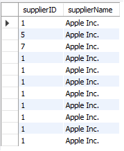

# Data Warehousing ETL

This project focuses on developing a near-real-time data warehouse for Electronica. It involves the implementation of the HYBRIDJOIN algorithm and a multi-threaded approach for efficient data processing.

## Prerequisites

Before running the project, ensure the following requirements are met:

- **Java Development Kit (JDK)**: Ensure JDK is installed on your machine.
- **MySQL Database**: The project requires MySQL as the database.
- **Integrated Development Environment (IDE)**: You can use Eclipse or IntelliJ IDEA.
- **JDBC Driver**: Make sure the JDBC driver for MySQL is installed.
- **Apache Commons Collections Library**: Required for the MultiValuedMap and ArrayListValuedHashMap.

## Setup

1. **Install the JDBC Driver**: Download and install the JDBC driver to connect to your MySQL database. This can be done through your IDE or manually.
2. **Install Apache Commons Collections**: Download and include the Apache Commons Collections library in your project's build path.

## Running the Project

To run the project, follow these steps:

1. **Load Data into MySQL**:
   - Ensure that the 'transactions' and 'master data' are loaded into your MySQL database.
   - Remember your database name, port number, and table names for both 'transactions' and 'master data'.

2. **Configure the Project**:
   - Start the program.
   - Enter the following details when prompted:
     - **Transaction Database Details**: Database name, SQL user, password, table name, and port number.
     - **Master Data Details**: Database name, user, password, table name, and port number.
     - **Data Warehouse Details**: Data warehouse name, password, user, and port number.
     - **Star Schema Details** Ensure StarSchema is named “ELECTRONICA-DW''.

## Execution

1. **Run the Program**: Execute the Project class in your IDE. The program will prompt you to enter the required details for the databases.
2. **Enter Database Details**: Carefully enter the database details as mentioned in the 'Configure the Project' section.
3. **Monitor the Output**: The program will process the data and provide output based on the HYBRIDJOIN algorithm and ETL processes.

# **Project Overview:**
In this project I am supposed to build Data-ware House for **Electronica**. The primary objective of this project is to build the online analysis of customer behavior in near real time. The core of this project is development of the near real time Extract, Transform, Load and incorporate the Hybrid Join Algorithm for efficient data Transformation. Using multi-threaded approach in Java. The project leverages a star schema in MySQL for storage which facilitates complex OLAP queries. Handling stream in near real time and then joining the master data with efficiency was the major part of this project.
# **Schema of Data-Ware House** 

# **Hybrid Join Algorithm:**

#
**
# **Hybrid Join Output**

# **Shortcomings of Hybrid Join**
1. The HYBRIDJOIN algorithm struggles to balance being fast with handling lots of data at once. It's great at quickly processing data as it comes in, but when there's a ton of data to deal with, it can't always keep up the pace. 
1. HYBRIDJOIN keeps all the incoming data in memory, even if it's not needed right away. This means it uses up more memory and makes the computer work harder to move data around. This can be a problem because it's not very efficient, especially in systems where saving memory and disk space is important.
1. In scenarios where the data stream is slow but processing by HYBRIDJOIN is fast, the algorithm may frequently access the disk for just one matching data point, while the remaining nine parts of the master data fetched become redundant. Therefore, maintaining a balance between the stream's speed and the processing rate is crucial to avoid inefficiency and wasteful data handling.
# **OLAP Queries**

Q1) Present total sales of all products supplied by each supplier with respect to quarter and month using drill down concept.

Q2) Find total sales of product with respect to month using feature of rollup on month and feature of dicing on supplier with name "DJI" and Year as "2019". You will use the grouping sets feature to achieve rollup. Your output should be sequentially ordered according to product and month.

Q3) Find the 5 most popular products sold over the weekends.

Q4) Present the quarterly sales of each product for 2019 along with its total yearly sales. Note: each quarter sale must be a column and yearly sale as well. Order result according to product

Q5) Find an anomaly in the data warehouse dataset. write a query to show the anomaly and explain the anomaly in your project report.

Different suppliers have same supplierID and different supplierID are assigned to to same suppliers

Q6) Create a materialised view with the name “STOREANALYSIS\_MV” that presents the product-wise sales analysis for each store.

Q7) Use the concept of Slicing calculate the total sales for the store “Tech Haven”and product combination over the months.

Q8) Create a materialized view named "SUPPLIER\_PERFORMANCE\_MV" that presents the monthly performance of each supplier.

Q9) Identify the top 5 customers with the highest total sales in 2019, considering the number of unique products they purchased.

Q10) Create a materialized view named "CUSTOMER\_STORE\_SALES\_MV" that presents the monthly sales analysis for each store and then customers wise.

# **Outcome of this Project**
Through this project, I not only achieved the development of a near-real-time data warehouse but also significantly enhanced my technical skills. I delved into Java, gaining practical experience with data structures, multi-threading, and integrating MySQL with Java. The hands-on journey through the stages of Extraction, Transformation, and Loading (ETL) was enlightening. Most importantly, this project was a testament to self-belief. Despite moments of doubt and the temptation to give up, I persevered, emerging more confident in my abilities. Now, I can confidently assert my capability in performing ETL tasks, a skill set bolstered by determination and hard-earned expertise.

# **References**

|||
| :- | :- |
|
1) [Naeem, M. A., Dobbie, G., & Weber, G. (2011). HYBRIDJOIN for near-real-time data warehousing. *International Journal of Data Warehousing and Mining (IJDWM)*, *7*(4), 21-42.](https://openrepository.aut.ac.nz/server/api/core/bitstreams/e381e308-87eb-4af3-9c8b-be640901b879/content)

||
|||
1) [How to create \[materialized\](https://stackoverflow.com/questions/3986366/how-to-create-materialized-views-in-sql-server) views in SQL Server?](https://stackoverflow.com/questions/3986366/how-to-create-materialized-views-in-sql-server)

1) [Producer-Consumer Problem in Java Multi-Threading](https://medium.com/@basecs101/producer-consumer-problem-in-java-multi-threading-latest-2a306f003973#:~:text=The%20Producer%2DConsumer%20Problem%20\(sometimes,is%20used%20as%20a%20queue.)

1) [ja\[va Concurrency & Multithreading \](https://www.youtube.com/watch?v=WldMTtUWqTg&t=3172s&pp=ygUXbXVsaXQgdGhyZWFkaW5nIGluIGphdmE%3D "Java Concurrency & Multithreading Complete Course in 2 Hours | Zero to Hero | Interview Questions")](https://www.youtube.com/watch?v=WldMTtUWqTg&t=3172s&ab_channel=RiddhiDutta)

